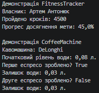

### Тема
Базовий синтаксис C# і оголошення класів.

Самостійна робота 1
1. Моделювання об'єктів реального світу: FitnessTracker, CoffeeMachine
   - FitnessTracker: OwnerName, StepsToday, методи AddSteps(), GetGoalProgressPercentage().
   - CoffeeMachine: Brand, WaterLevelLiters, метод MakeEspresso().
   - Вимоги: мінімум 2 приватні поля, властивості (зокрема read-only), конструктори, методи з обчисленнями.

### Хід роботи
1. Налаштовано Visual Studio Code та необхідні розширення.
2. Створено консольний проєкт IndependentWork1.
3. Реалізовано класи FitnessTracker та CoffeeMachine із дотриманням принципів інкапсуляції (приватні поля, публічні властивості).
4. Продемонстровано створення екземплярів класів, роботу їхніх методів та зміну стану об'єктів у методі Main().
5. Проєкт завантажено на GitHub.

### Результат
