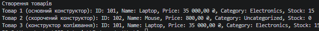

### Тема
Перевантаження конструкторів: приклади та сценарії.

Самостійна робота 2
1. Реалізація класу Product з різними рівнями деталізації даних.
   - Поля: id, name, price, category, stockCount.
   - Властивості: read-only (лише для читання).
   - Три перевантажені конструктори: основний (всі параметри), скорочений (без категорії та кількості), копіювання (передача іншого об'єкта).
   - Зв'язування конструкторів через ключове слово `: this(...)` для уникнення дублювання.
   - Перевизначення методу `ToString()` для форматованого виводу.

### Хід роботи
1. Налаштовано Visual Studio Code та необхідні розширення.
2. Створено консольний проєкт IndependentWork2.
3. Оголошено клас `Product` із приватними полями та публічними read-only властивостями.
4. Реалізовано три конструктори з використанням делегування через `this(...)`.
5. Перевизначено метод `ToString()` з форматуванням ціни.
6. Продемонстровано створення трьох товарів різними способами у методі `Main()` та виведено результат у консоль.
7. Проєкт завантажено на GitHub.

### Результат
