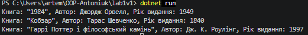

### Тема
Створення першого проєкту. Класи, об’єкти, конструктори та деструктори.
Середовище розробки.

Варіант
1. Клас Book
- Поля: title, author
- Властивість: Year
- Метод: GetInfo()

### Хід роботи
1. Налаштовано Visual Studio Code та необхідні розширення.
2. Створено консольний проєкт lab1v1.
3. Реалізовано клас Book з приватними полями, властивістю Year, конструктором та методом GetInfo().
4. Створено 3 об’єкти класу та викликано метод GetInfo().
5. Налаштовано Git та додано .gitignore.
6. Проєкт завантажено на GitHub.

### Результат
