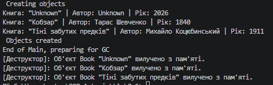

### Тема
Клас із кількома конструкторами. Життєвий цикл об’єкта.
Середовище розробки.

Варіант
1. Клас Book
- Поля: _title, _author, _year
- Властивості: Title, Author, Year
- Метод: GetFullInfo()

### Хід роботи
1. Налаштовано Visual Studio Code та необхідні розширення.
2. Створено консольний проєкт lab2v1.
3. Реалізовано клас Book з валідацією у властивостях, перевантаженими конструкторами з ланцюговим викликом (: this), методом та деструктором.
4. Створено 3 об’єкти класу різними конструкторами та викликано метод GetFullInfo().
5. Продемонстровано роботу Garbage Collector через GC.Collect().
6. Проєкт завантажено на GitHub.

### Результат
