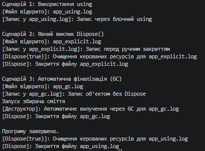

### Тема
Життєвий цикл об’єкта та керування ресурсами.
Середовище розробки.

Варіант
1. Клас FileLogger
- Поля: _filePath, _isFileOpen
- Властивості: FilePath, IsFileOpen
- Метод: Log()

### Хід роботи
1. Налаштовано Visual Studio Code та необхідні розширення.
2. Створено консольний проєкт lab3v1.
3. Реалізовано клас FileLogger з підтримкою IDisposable, полями, властивостями, конструктором, методом Log(), патерном Dispose та деструктором.
4. Продемонстровано 3 сценарії використання об'єкта в Main (using, явний виклик Dispose, запуск GC.Collect).
5. Налаштовано Git та додано .gitignore.
6. Проєкт завантажено на GitHub.

### Результат
