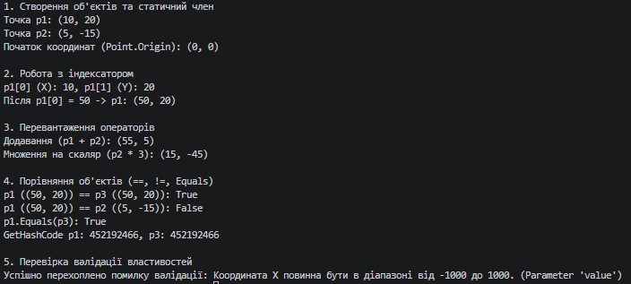

### Тема
Властивості та статичні члени. Індексатори й перевантаження операторів.
Середовище розробки.

Варіант
1. Клас Point (Точка в 2D)
- Поля: _x, _y
- Властивості: X, Y (валідація: -1000 до 1000)
- Статичний член: Origin
- Перевантажені оператори: +, *, ==, !=
- Перевизначені методи: ToString(), Equals(), GetHashCode()

### Хід роботи
1. Налаштовано Visual Studio Code та необхідні розширення.
2. Створено консольний проєкт lab4v1.
3. Реалізовано клас Point із валідацією координат, статичним членом Origin, індексатором, перевантаженими операторами (+, *, ==, !=) та перевизначеними методами Equals/GetHashCode/ToString.
4. Продемонстровано роботу всіх елементів класу в методі Main().
5. Налаштовано Git та додано .gitignore.
6. Проєкт завантажено на GitHub.

### Результат
