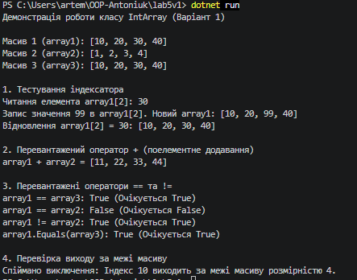

### Тема
Індексатори та перевантаження операторів.
Середовище розробки.

Варіант
1. Клас IntArray (Масив цілих чисел)
- Поле: _data
- Властивість: Length
- Індексатор: this[int index]
- Перевантажені оператори: +, ==, !=
- Перевизначені методи: ToString(), Equals(), GetHashCode()

### Хід роботи
1. Налаштовано Visual Studio Code та необхідні розширення.
2. Створено консольний проєкт lab5v1.
3. Реалізовано клас IntArray із властивістю Length, індексатором, перевантаженими операторами (+, ==, !=) та перевизначеними методами Equals/GetHashCode/ToString.
4. Продемонстровано роботу всіх елементів класу в методі Main().
5. Налаштовано Git та додано .gitignore.
6. Проєкт завантажено на GitHub.

### Результат
