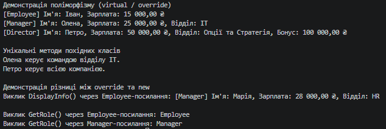

### Тема
Наслідування. Ключові слова base, override, virtual. Приховування членів (new).

Варіант
1. Ієрархія Employee → Manager → Director
   - Employee (базовий): Name, Salary, virtual void DisplayInfo(), string GetRole().
   - Manager (похідний): Department, override void DisplayInfo(), void ManageTeam(), new string GetRole().
   - Director (похідний): Bonus, override void DisplayInfo(), void LeadCompany().

### Хід роботи
1. Налаштовано Visual Studio Code та необхідні розширення.
2. Створено консольний проєкт lab6v1.
3. Реалізовано ієрархію класів Employee, Manager та Director із використанням ключових слів base, virtual, override та new.
4. Продемонстровано поліморфну поведінку та різницю між override і new у методі Main().
5. Проєкт завантажено на GitHub.

### Результат
