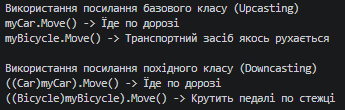

### Тема
Приховування методів (new) vs перевизначення (override).

Варіант 1
1. Ієрархія Vehicle → Car (override) / Bicycle (new)
   - Vehicle (базовий): virtual void Move().
   - Car (похідний): override void Move() -> "Driving on the road".
   - Bicycle (похідний): new void Move() -> "Pedaling on the path".

### Хід роботи
1. Налаштовано Visual Studio Code та необхідні розширення.
2. Створено консольний проєкт lab7v1.
3. Реалізовано ієрархію класів Vehicle, Car та Bicycle із використанням ключових слів virtual, override та new.
4. Продемонстровано поліморфну поведінку та різницю між override і new у методі Main() при виклику через посилання базового та похідного типів.
5. Проєкт завантажено на GitHub.

### Результат
