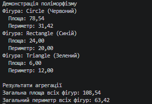

### Тема
Поліморфізм: динамічне зв’язування та перевизначення методів.

Варіант 1
1. Поліморфні фігури: Shape → Circle, Rectangle, Triangle
   - Shape (базовий): Color, virtual double GetArea(), virtual double GetPerimeter().
   - Circle (похідний): Radius, override GetArea(), override GetPerimeter().
   - Rectangle (похідний): Width, Height, override GetArea(), override GetPerimeter().
   - Triangle (похідний): SideA, SideB, SideC, override GetArea() (за формулою Герона), override GetPerimeter().
   - Агрегація: Обчислити сумарну площу та сумарний периметр всіх фігур.

### Хід роботи
1. Налаштовано Visual Studio Code та необхідні розширення.
2. Створено консольний проєкт lab8v1.
3. Реалізовано ієрархію класів Shape, Circle, Rectangle та Triangle із використанням віртуальних методів та їх перевизначення.
4. Продемонстровано поліморфізм та агрегацію результатів (сумарна площа та периметр) через колекцію List<Shape> у методі Main().
5. Проєкт завантажено на GitHub.

### Результат
